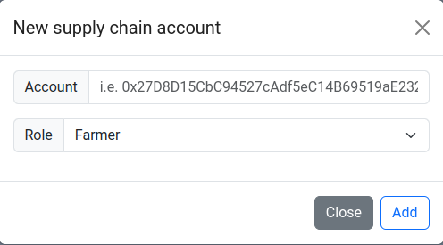

# Udacity | Blockchain Developer nano-degree | Project 3 | Architect a Blockchain Supply Chain Solution

- [Udacity | Blockchain Developer nano-degree | Project 3 | Architect a Blockchain Supply Chain Solution](#udacity--blockchain-developer-nano-degree--project-3--architect-a-blockchain-supply-chain-solution)
  - [Architecture](#architecture)
    - [Activity](#activity)
    - [Sequence](#sequence)
    - [State](#state)
    - [Data Model](#data-model)
  - [Installation](#installation)
  - [Configuration](#configuration)
    - [Infura IPFS Service](#infura-ipfs-service)
  - [Usage](#usage)
    - [Run the app](#run-the-app)
    - [Use the app](#use-the-app)
      - [Overview](#overview)
      - [Top bar](#top-bar)
        - [Item lookup](#item-lookup)
        - [Actions](#actions)
          - [Add new harvest](#add-new-harvest)
          - [Add new supply chain account](#add-new-supply-chain-account)
      - [Current account info](#current-account-info)
      - [Item details](#item-details)
  - [Libraries](#libraries)
  - [Sepolia network deployment](#sepolia-network-deployment)

This project is an Ethereum DApp that implements a Supply Chain flow among various parties such as Farmers, Distributors, Retailers and Consumers. The sections below describe the architecture of the project, considerations and deviations from the original boilerplate as well as installation and usage guide of the DApp.

## Architecture
Below are the UML diagraps that describe the architecture of the DApp:

### Activity


### Sequence


### State


### Data Model


## Installation

```
cd app
npm install
```
## Configuration
If you intend to upload images in your DApp make sure to configure Infura IPFS Service. See next section for more details.

### Infura IPFS Service
The product images are uploaded to IPFS via the [Infura IPFS API](https://www.infura.io/product/ipfs). After an image upload, the API returns its unique hash which is saved in the item details storage of the smart contract.

The acquired, from [infura.io](https://app.infura.io/dashboard), `PROJECT_ID`, `PROJECT_SECRET` and `DEDICATED_GATEWAY_SUBDOMAIN` must be put in a `secrets.json` file under the `app` directory.

Here is an example:
```json
{
    "PROJECT_ID": "<my-project-id>",
    "PROJECT_SECRET": "<my-project-secret>",
    "DEDICATED_GATEWAY_SUBDOMAIN": "<my-dedicated-gateway-subdomain>"
}
```

## Usage

### Run the app
Start the app with:
```
npm run dev
```
Typically the app will be running at [http://localhost:8081](http://localhost:8081)

> The Metamask account that will be connected during the deployment of the smart contract will acquire all the subroles, i.e. Farmer, Distributor, Retailer and Consumer. That means that the whole workflow of the DApp can be done with that single account. However, it is advisable to connect different accounts in Metamask and assign (as owner) different roles to them. That way you'll get a better perspective of the permissions layer ofthe DApp. For you convenience you can use the provided `start_ganache.sh` script. That will initiate Ganache always with the same accounts.

### Use the app
#### Overview
The app UI is divided in the [top bar](#top-bar) and the [item details](#item-details) area. Moreover, in the area between those areas the [current connected Metamask account](#current-account-info) is displayed along with its assigned roles.

#### Top bar
##### Item lookup
On the right side of the top bar the user can lookup any registered item by its UPC. The fetched data will be displayed in the [Item details](#item-details) area.


##### Actions
The actions dropdown menu has 2 options:


###### Add new harvest
This action is allowed only to accounts having the `Farmer` role. The user can provide the following information:


###### Add new supply chain account
The action is allowed for all the roles however each role can assign only roles of its kind, i.e. a `Farmer` can assign only the `Farmer` role to an account, etc. The `Owner` of the contract can assign any role.



#### Current account info
In this area the current account address is displayed along with its assigned roles:


#### Item details
In this area all the information of an item is displayed:
- Product notes
- SKU
- UPC
- Selling price in ETH (if the item is for sale)
- A mix of state information and item action buttons. The current pending action is available on a clickable button for the currently connected account, but only if its role allows it. For more information on the role permission check the corresponding [UML diagrams](#architecture)
- Farm details (name, details, latitude, longitude)
- The involved accounts (origin farmer, distributor, retailer, consumer) along with a tag indicating the current ownership of the item.
- The transaction history of the events which validates the authenticity of the product.
- The uploaded on IPFS image of the product (if applicable).


## Libraries
The following libraries were used:
- `web3.js v1.2.4`: for interacting with the Smart Contracts and Metamask
- `axios v1.5.1`: for interacting with Infura IPFS API (up/downloading images)
- `bootstrap v5.3.2`: for better UI
- `@truffle/hdwallet-provider v2.1.15`: for deploying the smart contracts to Sepolia network

Truffle version:
```shell
⟩ truffle -v
Truffle v5.11.5 (core: 5.11.5)
Ganache v7.9.1
Solidity - 0.4.24 (solc-js)
Node v18.18.0
Web3.js v1.10.0
```

## Sepolia network deployment
Smart contract address: [0xc1ce42EbE73C87aa77e4667eDF387E056FD4B9Ee](https://sepolia.etherscan.io/address/0xc1ce42EbE73C87aa77e4667eDF387E056FD4B9Ee)

Transaction: [0xda12492c8ed7667c104d1030187071d4aeed5cb528c1ddd437a836be1fd25697](https://sepolia.etherscan.io/tx/0xda12492c8ed7667c104d1030187071d4aeed5cb528c1ddd437a836be1fd25697)